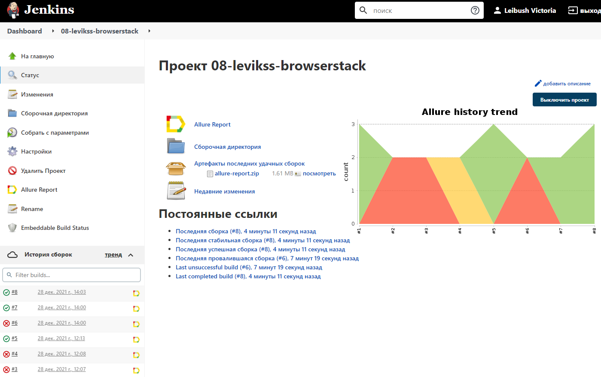
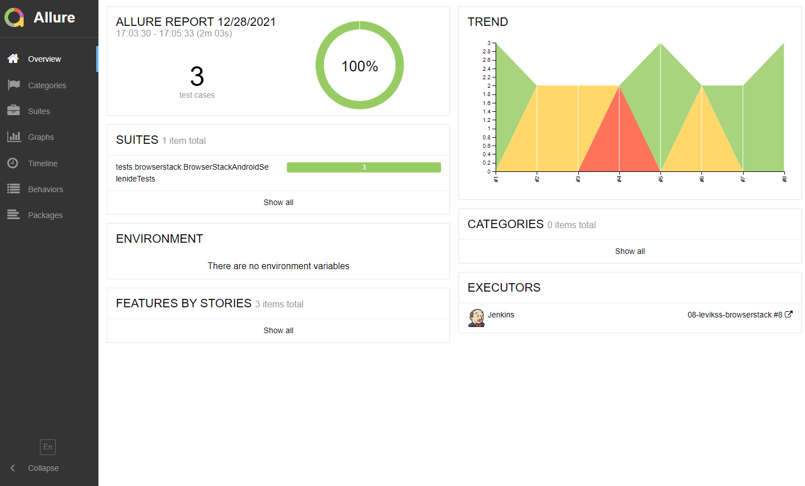
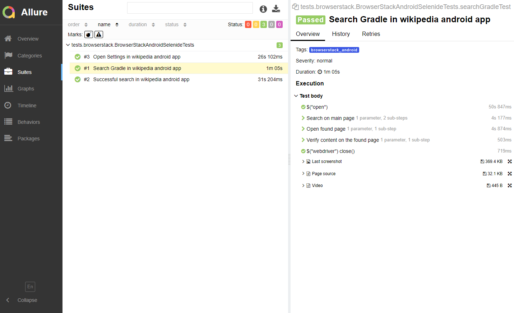
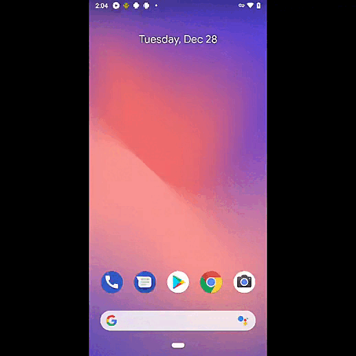

# Проект с автотестами для мобильного приложения Wikipedia

## :gear: Стек технологий:
| IDEA | Java | Selenide | Selenoid | Allure Report | Gradle | Junit5 | GitHub | Jenkins | Rest-Assured | Appium | Browserstack |
|:--------:|:-------------:|:---------:|:-------:|:----:|:------:|:----:|:----:|:------:|:------:|:--------:|:--------:|
|  |  |  |  |  |  |  |  |  |  |  |  |
___

## :heavy_check_mark: Тестируемая функциональность
- Выполнение поиска
- Переход в раздел настроек
- Прохождение getting started

## :pushpin: В качестве CI системы использован Jenkins
### [Проект](https://jenkins.autotests.cloud/job/08-levikss-browserstack/)



## :arrow_forward: Запуск тестов

Для запуска тестов необходим файл credential.properties
```
browserStackUser=<значение User с Browserstack>
browserStackKey=<значение Key с Browserstack>
browserStackAppURL=bs://c700ce60cf13ae8ed97705a55b8e022f13c5827c // для Samsung Galaxy S9
selenoidUser=<значение User с selenoid.autotests.cloud>
selenoidPass=<значение Pass с selenoid.autotests.cloud>
```
Для запуска тестов на реальном устройстве необходимо выполнить следующую команду:
```
gradle clean local
```
Для запуска тестов в selenoid необходимо выполнить следующую команду:
```
gradle clean selenoid
```
Для запуска тестов на сервисе browserstack необходимо выполнить следующую команду:
```
gradle clean browserstack
```

## :bar_chart: Генерация отчета происходит в Allure Report

Для генерации отчета необходимо выполнить следующую команду:

```
allure serve build/allure-results
```



К каждому тесту прикладываются:
- Скриншоты
- Исходники страницы
- Видео



## :movie_camera: Видео с прохождением теста на поиск в мобильном приложении Wikipedia

 
